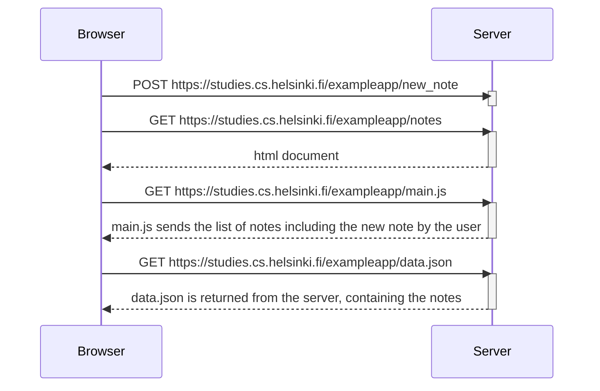

```mermaid
sequenceDiagram
    participant b as Browser
    participant s as Server

    b->>s: POST https://studies.cs.helsinki.fi/exampleapp/new_note
    activate s
    deactivate s

    b->>s: GET https://studies.cs.helsinki.fi/exampleapp/notes
    activate s
    s-->>b: html document
    deactivate s

    b->>s: GET https://studies.cs.helsinki.fi/exampleapp/main.js
    activate s
    s-->>b: main.js sends the list of notes including the new note by the user
    deactivate s

    b->>s: GET https://studies.cs.helsinki.fi/exampleapp/data.json
    activate s
    s-->>b: data.json is returned from the server, containing the notes
    deactivate s
```