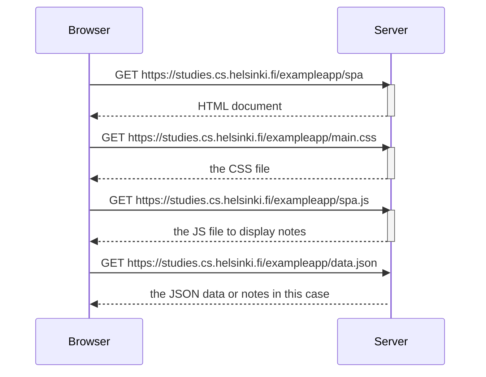

```mermaid
sequenceDiagram
    participant b as Browser
    participant s as Server

    b->>s: GET https://studies.cs.helsinki.fi/exampleapp/spa
    activate s
    s-->>b: HTML document
    deactivate s

    b->>s: GET https://studies.cs.helsinki.fi/exampleapp/main.css
    activate s
    s-->>b: the CSS file
    deactivate s

    b->>s: GET https://studies.cs.helsinki.fi/exampleapp/spa.js
    activate s
    s-->>b: the JS file to display notes
    deactivate s

    b->>s: GET https://studies.cs.helsinki.fi/exampleapp/data.json
    activate s
    s-->>b: the JSON data or notes in this case
```